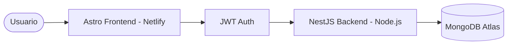

# Arquitectura de la Aplicación: Sergio Nolasco

La plataforma utiliza una arquitectura desacoplada para separar las responsabilidades del frontend y el backend, permitiendo escalabilidad y facilidad de mantenimiento.

## Stack Tecnológico

### Frontend & Backend: [Astro](https://astro.build/)
- **Propósito**: Aplicación unificada (Monorepo) para frontend y backend.
- **Backend (Node.js/TS)**: Implementado mediante **Astro API Routes** o **Netlify Functions**.
- **Justificación**: Permite un despliegue atómico y simplificado en un solo proyecto de GitHub y Netlify.
- **Hosting**: **Netlify**, gestionando tanto el sitio estático como las funciones serverless de backend.

### Autenticación
- **JWT (JSON Web Tokens)**: Implementado en las rutas de API de Astro.

### Base de Datos: [MongoDB Atlas](https://www.mongodb.com/cloud/atlas)
- **Tipo**: NoSQL (Documental).
- **Propósito**: Almacenamiento persistente de usuarios y metas.

## Flujo de Datos

1.  **Exploración**: El usuario accede al Home (Astro/Netlify).
2.  **Autenticación**: El usuario se registra o inicia sesión. La solicitud viaja al backend (NestJS/Node.js).
3.  **Sesión**: El backend valida las credenciales contra MongoDB Atlas y devuelve un JWT.
4.  **Gestión de Metas**: El frontend utiliza el JWT para autorizar peticiones al backend para crear, actualizar o ver "Futuros Imposibles".
5.  **Evidencias**: Los archivos de evidencias se gestionan a través del backend para asegurar la vinculación correcta con el usuario en la base de datos.

## Diagrama de Macro-Arquitectura

